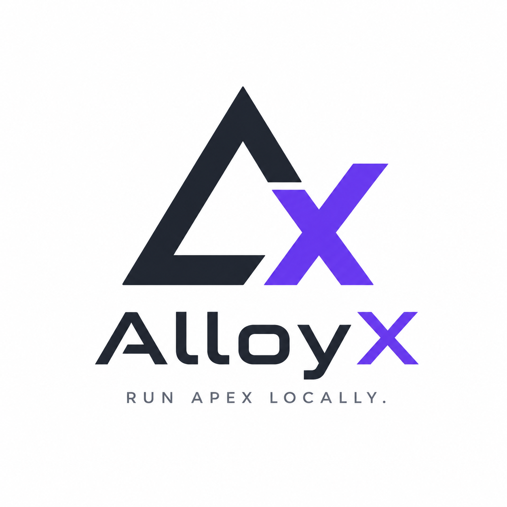

# AlloyX

> Run your **Apex** locally — on your machine, in milliseconds. No redeploy, no rewrite.

AlloyX is an *alloy* of Apex and Java: it transpiles your Apex to Java, compiles it in-memory, and runs it on a local JVM. The same class that runs in your org runs here — unchanged.

---

## Why

Apex is **cloud-bound** — it only runs inside the org. So every change is a round-trip to the cloud:

> **edit → deploy → test → debug** … and back to edit. In the cloud. Every time.

- 🔁 **The loop *is* a deploy.** Save → **deploy** to a sandbox/scratch org (seconds to minutes) → run it **in the cloud** → wait → repeat. Every tweak pays the round-trip, and the latency kills your flow.
- 🪵 **"Debugging" is grepping logs.** `System.debug` + trace flags + a truncated debug log you download and read. No real breakpoints — the Apex Debugger is Enterprise-only, slow, and ties up an org.
- 🔒 **Nothing runs without an org.** No REPL, no "just run this method." You need a configured org, a connection, the deploy queue and API limits — to try ten lines of logic.
- 🐢 **Mistakes surface late.** A wrong type or a misspelled field only shows up when the org compiles your deploy — minutes later, not as you type.
- 🧱 **Heavy logic means leaving Apex.** Anything past the governor limits gets rewritten into another service or language (the road **Salesforce Functions** took — now discontinued): a second codebase that drifts from the original.

**AlloyX gives that loop back to your machine.** Your real Apex runs on a local JVM in **milliseconds** — edit → run → **set a real breakpoint** → repeat, offline, no deploy. SOQL/DML reach the org only when you actually need real data. The **VS Code extension** already runs methods and flags type errors as you type; step-through debugging from the editor is in development.

## What you get

- ⚡ **Instant dev loop** — save → run in **ms**, just the class you changed. Real Java breakpoints. Offline for pure logic.
- 🔎 **Catch type errors before you deploy** — assign a `String` to an `Integer` field, call a field or method that doesn't exist, and see it flagged **as you type in VS Code** — the org's own compile errors, on your machine in milliseconds instead of minutes after a deploy.
- 🪶 **Less impact** — no burned deploys or API calls, no polluting the org just to try something.
- 🚀 **Batch / ETL without governor limits** — runs on your machine's CPU/RAM, not the platform's.
- 🔌 **Real data when you need it** — SOQL/DML run against your org's REST API, authenticated with the token from the `sf` CLI; pure logic stays local, only the data crosses the line.

## The idea — freedom of choice

AlloyX runs **your actual Apex** — no rewrite, no porting to JS. You decide **where** your logic runs:

- in the **org** for triggers and real-time, and
- **locally** for dev, batch and ETL

…from a **single source of truth**. One class, one bug fix, runs in both places.

## How it works

```
your.cls (Apex)
   → transpiled to Java   (almost identical — it IS Java underneath)
   → compiled in-memory   (javac, kept as a visible .java for breakpoints)
   → run on the JVM
```

Org access goes through a pluggable gateway: the **`sf` CLI** hands over the access token (`sf org display`), and queries/DML hit the **REST API** directly. The `sf` CLI is just the credential broker — AlloyX owns the data layer.

## ⚠️ Org access runs as your `sf` user

AlloyX has no Salesforce login of its own — it borrows the access token of whoever is authenticated in the `sf` CLI. Any SOQL/DML you run through AlloyX executes **with that user's permissions** (object & field-level security, sharing, record access).

Two things to keep in mind:

- **It's the real org.** `insert`/`update`/`delete` change real records in the org you point at, with that user's privileges. Use a **sandbox or scratch org** for anything that writes — don't experiment against production.
- **Permissions ≠ org runtime.** Inside the org, Apex often runs in *system mode* (e.g. triggers); through the API it runs **as the user**. Results that depend on FLS/sharing can differ from how the same class behaves in the org — "passed locally" isn't "runs identically in the org" for permission-sensitive logic.

## Install & run

**Requirements:** a **JDK 21+** — a *JDK*, not a JRE (AlloyX compiles Java at runtime) — and Git. No JDK? Grab [Temurin 21](https://adoptium.net) (`brew install --cask temurin@21`, or with [sdkman](https://sdkman.io): `sdk install java 21-tem`).

```bash
git clone https://github.com/colatusso/alloyx.git
cd alloyx
./gradlew run --args="run examples/Hello.cls --method Hello.run"
# → DEBUG|5
```

The first run downloads Gradle and the dependencies (needs internet).

**Optional — get the `allx` command** (so you can type `allx …` instead of `./gradlew run --args=…`):

```bash
./gradlew installDist
# launcher lands at build/install/allx/bin/allx — symlink it onto your PATH, e.g.:
ln -s "$PWD/build/install/allx/bin/allx" ~/.local/bin/allx
allx run examples/Hello.cls --method Hello.run
```

> Native installers (`.dmg`/`.msi`, no JDK needed) are coming. For now it's clone + build.

## Quickstart

```bash
# run a static method
allx run MyClass.cls --method MyClass.run

# run all @isTest tests in a folder
allx test .

# hit a real org (token via the sf CLI)
allx run AccountDemo.cls --method AccountDemo.run --org my-org

# inspect the generated Java
allx transpile MyClass.cls
```

Point at an org once with `alloyx.json` in your project (instead of `--org` every time):

```json
{ "org": "my-org-alias", "apiVersion": "60.0" }
```

## Status

Early but working: classes & methods (incl. **inner classes**, **interfaces**, **enums**), control flow (`if`/`while`/`for`/`for-each`/ternary), OO (fields, constructors, instance methods, inheritance), **exceptions** (`try`/`catch`/`finally`/`throw`), collections (`List`/`Set`/`Map`) and `Decimal`/`Date`/`Datetime`, **SOQL/DML/sObjects against a real org**, **typed sObject field access** — with describe-backed validation that catches a `String` put in a `Number` field or a field that doesn't exist (cached via `schema sync`, then offline) — plus an `@isTest` runner and a **VS Code extension** that runs methods from a CodeLens and flags type errors inline as you type.

Coming: broader built-in coverage, step-through debugging from the editor, and the full **pre-deploy validation** flow — run your `@isTest` suite locally before you push.

## What AlloyX is *not*

It is **not** "run any Apex with 100% fidelity". Triggers (before/after context), transactions/rollback, and FLS/sharing don't map 1:1. The focus is **pure domain logic + tests** — exactly the part that benefits from running fast and local.

## Built on

A small Apex → Java transpiler running on the JVM (Java 21). Shipping as a native binary with an embedded runtime — no JDK to install — *soon*.
